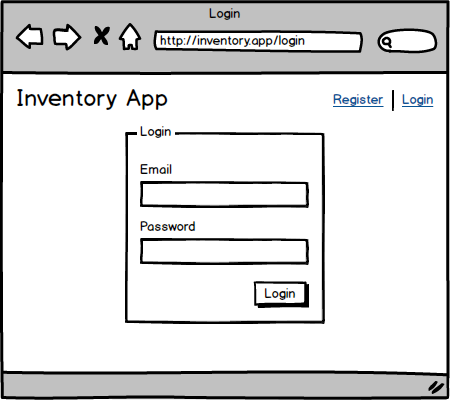
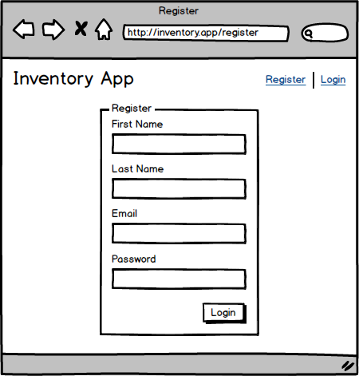
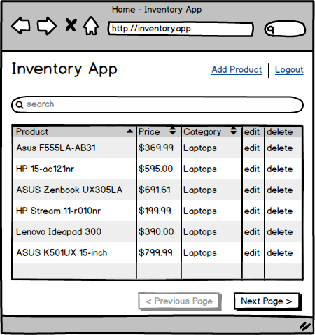
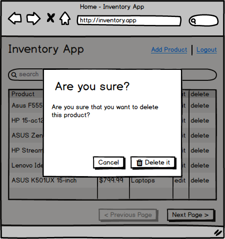
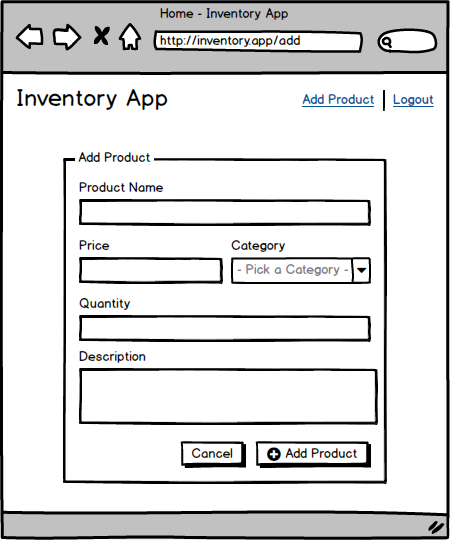
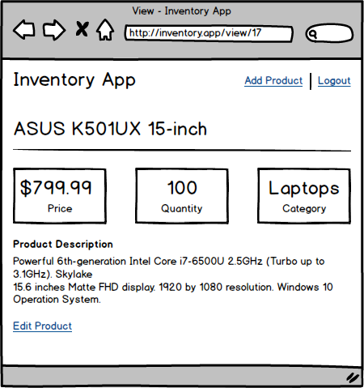
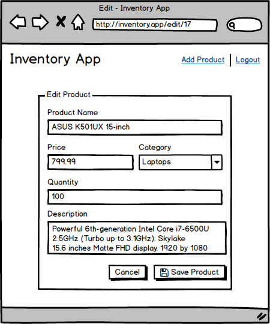

# Auditor Final Project Requirements

### Overall
- [5] Page stays consistent when refreshed

### Home Page (logged out)
 - [1] Contains buttons to login and register

### Login Page
- [1] Correct URL
- [2] Client side validation
- [2] Displays server side errors
- [3] Sets the users logged in session
- [1] Navigates back to the home page on success

### Register Page
- [1] Correct URL
- [2] Client side validation
- [2] Displays server side errors
- [2] Creates the user account
- [1] Navigates back to the home page on success

### Home Page (logged in)
- [4] Contains a search box that searches product names and displays results in a table
- [3] The table displays product name, price, category and edit / delete links.
- [2] Clicking on a delete link brings up a popup.
- [3] Clicking the edit link redirects to the correct edit page
- [4] Clicking on a column sorts the rows in the table by that column (ascending)
- [3] Clicking on a column sorts again the rows in the table by that column (descending)
- [3] Clicking on a row redirects to the correct view page for that product

### Delete Popup
- [1] Clicking cancel closes the popup without deleting the product
- [3] Clicking delete closes the popup and permanently deleted the product
- [2] Correct product is removed from the home page without refreshing the page

### Add Page
- [1] Correct URL
- [2] If a user tries to access this page without being logged in, they should be redirected to the login page.
- [3] Client side validation
- [3] Creates the product
- [1] Displays server side errors
- [1] Navigates to the view page for that product on success

### View Page
- [2] Correct URL
- [2] If a user tries to access this page without being logged in, they should be redirected to the login page.
- [3] Displays all product information (name, price quantity, category, description)

### Edit Page
- [2] Correct URL
- [2] If a user tries to access this page without being logged in, they should be redirected to the login page.
- [3] Prefilled with existing product information (name, price quantity, category, description)
- [2] Client side validation
- [1] Displays server side errors
- [3] Updates the existing product on success
- [1] Navigates to the view page for that product on success

### Global Navigation
- [1] Shows clickable logo that takes you to the home page
- Logged out
	- [2] Shows register link that takes you to register page
	- [1] Shows login link that takes you to login page
- Logged in
	- [2] Shows add product link tha takes you to add page
	- [1] Shows add product logout link that logs you out and takes you to home page

### Design
- [3] Responsive
- [2] Use of a grid system
- [2] Consistent color scheme
- [3] Styled headers, paragraphs, links, buttons and form elements
